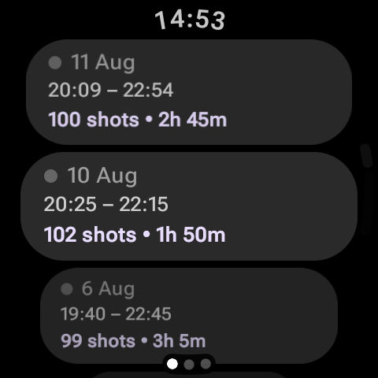
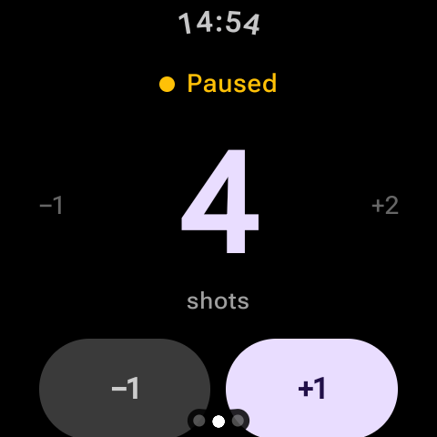
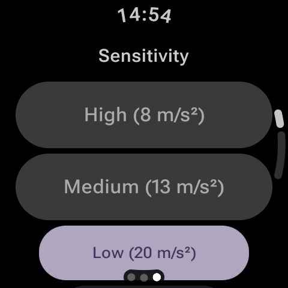

# Archery Shot Counter

A WearOS app for archers that automatically counts shots using the wrist accelerometer — no buttons needed during shooting. Works with any bow style (compound, Olympic recurve, barebow, traditional) and on either wrist — just tune the sensitivity to match your setup.

## Screenshots

  

## Features

- **Automatic shot detection** — detects the recoil impulse of a bow release via the wrist accelerometer
- **Manual adjustment** — tap +/− to correct the count if needed
- **Session tracking** — start, pause, resume and end training sessions
- **Session history** — browse past sessions with date, time range, shot count and duration
- **Per-shot detail** — see the timestamp and impact strength of every recorded shot in a session
- **Adjustable sensitivity** — High / Medium / Low / Custom threshold
- **Configurable shot cooldown** — tune the dead time between shots to avoid false triggers
- **Shots per end** — optional series markers with auto-pause between ends
- **Ambient Mode** — dims the screen during a session instead of staying at full brightness, on watches with Always-On Display; falls back to a manually dimmed screen otherwise
- **Export / import training data** — back up and restore your sessions as a JSON file (see [Data export/import](#data-exportimport) below)
- **12 interface languages** — English, Russian, Spanish, French, German, Portuguese, Chinese, Japanese, Korean, Arabic, Turkish and Hindi

## Requirements

- Wear OS 3.0+ smartwatch (Android API 30+)
- Wrist-mounted accelerometer (standard on all WearOS watches)
- Tested on Galaxy Watch 6 Classic (bow arm, compound bow)

## Installation

Download the latest APK from the [Releases](https://github.com/Vemestael/ArcheryShotCounter-wearos/releases) page and sideload it to your watch via Wi-Fi ADB.

### 1. Prepare the watch

1. Make sure the watch and your PC are on the **same Wi-Fi network**.
2. On the watch, open **Settings → System → About** and tap **Build number** 7 times to enable Developer options.
3. Go to **Settings → Developer options** and enable:
   - **ADB debugging**
   - **Debug over Wi-Fi**
4. Open **Settings → Developer options → Debug over Wi-Fi → Pair device** — the watch will display an **IP address**, a **port**, and a **pairing code**.

### 2. Pair and connect from your PC

```bash
# Pair once using the code shown on the watch
adb pair <watch-ip>:<pairing-port> <pairing-code>

# Then connect
adb connect <watch-ip>:<port>
```

### 3. Install the APK

```bash
adb install ArcheryShotCounter-<version>.apk
```

## How it works

The app listens to `TYPE_LINEAR_ACCELERATION` (gravity-compensated) sensor data. When the string is released, the recoil creates a spike in wrist acceleration. If that spike exceeds the sensitivity threshold, a shot is counted, the watch vibrates briefly, and the sensor stops listening for the configured cooldown period before resuming.

The optimal sensitivity depends on your bow style and which wrist you wear the watch on — the bow arm typically produces a stronger impulse than the string arm. Use the Custom threshold if the presets don't work well for your setup.

## Data export/import

Settings → Data. Wear OS has no general-purpose file picker, so export and import don't use a "Save As" dialog — they read/write a fixed file under the app's own external storage instead:

```bash
# Export: tap "Export data" in the app, then pull the file it reports
adb pull /storage/emulated/0/Android/data/com.vemestael.archeryshotcounter/files/archery-export-<timestamp>.json

# Import: push a file named exactly archery-import.json to the same folder, then tap "Import data"
adb push archery-export-<timestamp>.json /storage/emulated/0/Android/data/com.vemestael.archeryshotcounter/files/archery-import.json
```

## Building from source

```bash
git clone https://github.com/Vemestael/ArcheryShotCounter-wearos.git
cd ArcheryShotCounter
./gradlew assembleDebug
```

For a signed release build, create `keystore.properties` in the project root (not committed):

```properties
storeFile=/path/to/your.jks
storePassword=...
keyAlias=...
keyPassword=...
```

Then run:

```bash
./gradlew assembleRelease
```

## License

MIT — see [LICENSE](LICENSE).
